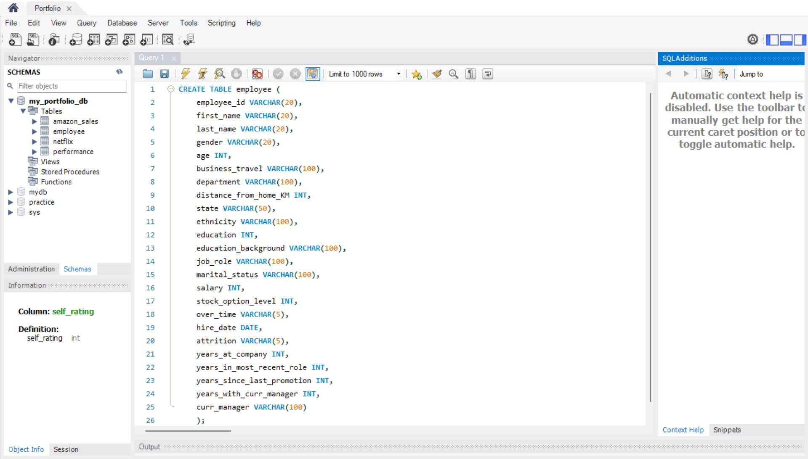
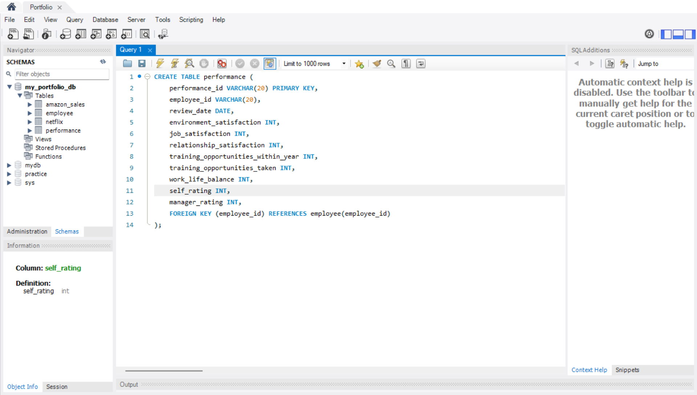

# HR Analytics Employee Attrition Performance (SQL)
For this portfolio, I used the HR Analytics: Employee Attrition &amp; Performance dataset from Kaggle to demonstrate my capability in writing intermediate SQL queries and performing basic advanced analysis. The project focuses on analyzing employee data, performance ratings, and attrition trends to derive actionable insights

# Introduction
This portfolio uses the HR Analytics: Employee Attrition & Performance dataset from Kaggle to demonstrate my skills in intermediate SQL queries, with some advanced SQL techniques. The project focuses on analyzing employee information, performance ratings, and attrition trends to extract actionable insights for HR decision-making.

## Employee Table

## Performance Table

### Explanation
Foreign Key is used to link employee_id in performance table to employee table in order to test JOIN clause in the queries.

## Intermediate Queries

###
