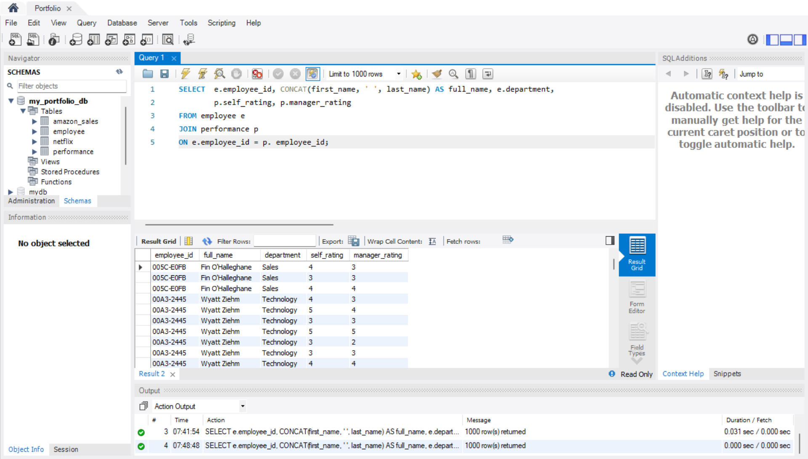
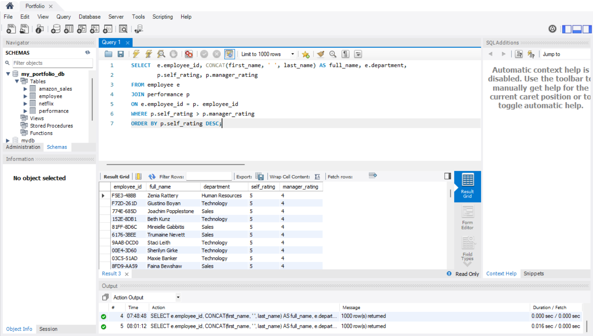
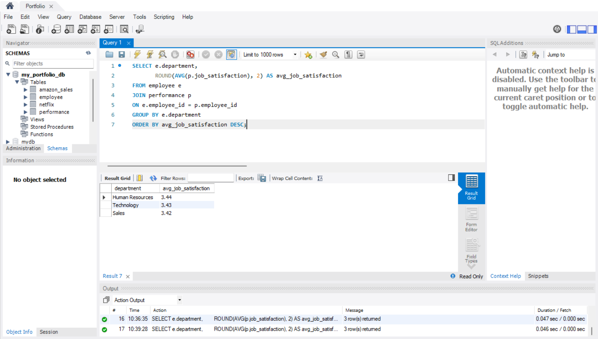
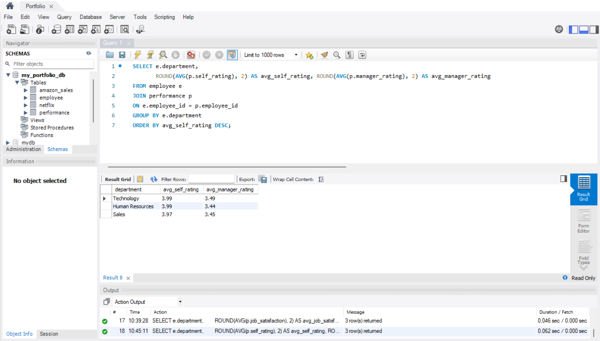
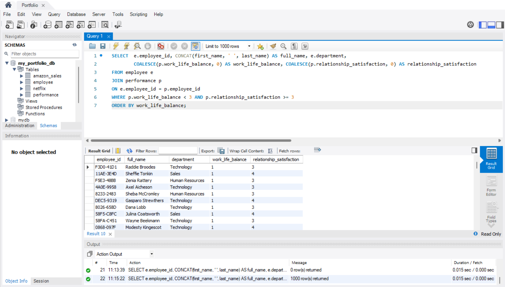
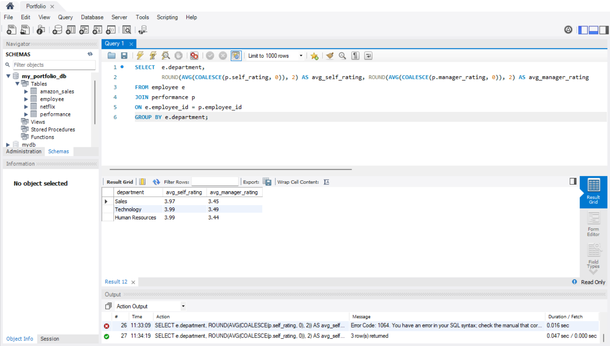
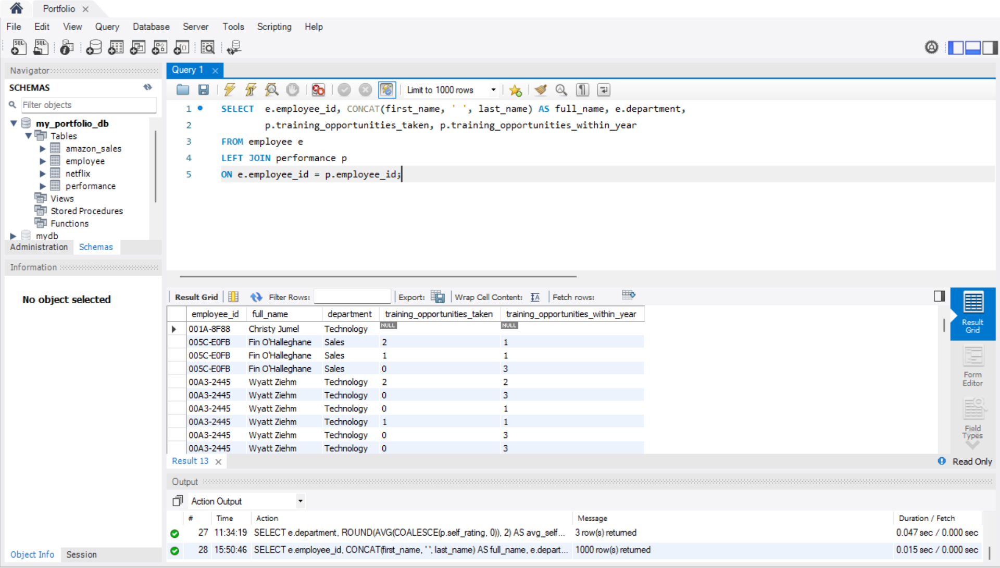
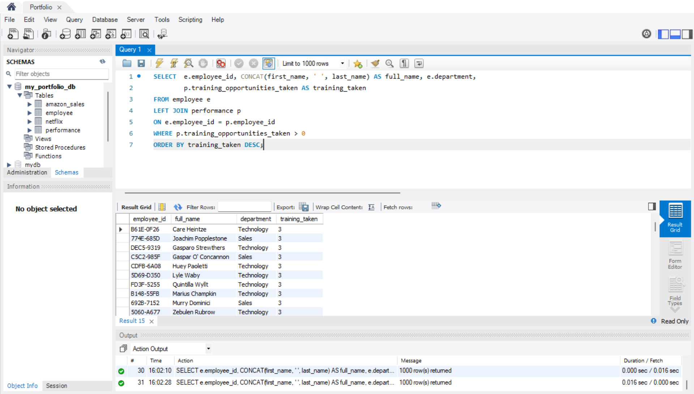
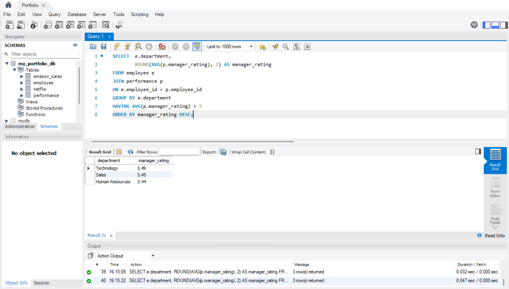

# HR Analytics Employee Attrition Performance (SQL)
For this portfolio, I used the HR Analytics: Employee Attrition &amp; Performance dataset from Kaggle to demonstrate my capability in writing intermediate SQL queries and performing basic advanced analysis. The project focuses on analyzing employee data, performance ratings, and attrition trends to derive actionable insights

# Introduction
- In this project, I analyzed an Employee & Performance dataset from a company called Amirul X (fake company name) to explore workforce distribution, satisfaction levels, and training opportunities.
- The goal is to provide insights into employee engagement and areas where management can improve.

## Employee Table

## Performance Table

### Explanation
Foreign Key is used to link employee_id in performance table to employee table in order to test JOIN clause in the queries.

### The Dataset
[Employee.csv](Employee.csv)
[PerformanceRating.csv](PerformanceRating.csv)

## Intermediate Queries

### Employees Overview (JOINS)

#### Explanation of the Clause
A JOIN is used to combine data from two tables based on a related column. In this dataset, we commonly join on employee_id to retrieve information from both the employee and performance tables for each employee.

#### List of Employees with their Self and Manager Rating
SELECT 	e.employee_id, CONCAT(first_name, ' ', last_name) AS full_name, e.department,
		p.self_rating, p.manager_rating
FROM employee e
JOIN performance p
ON e.employee_id = p. employee_id;

##### Insight from the Query
- From this data, we are able to see all employees that who have completed self-evaluation and also already received evaluation rating from their managers.
- This allows Amirul X to compare employees’ self-assessments with their managers’ evaluations and identify differences in perception of performance.

##### Screenshot of the Query

#### List of Employees with Performance Gaps
SELECT 	e.employee_id, CONCAT(first_name, ' ', last_name) AS full_name, e.department,
		p.self_rating, p.manager_rating
FROM employee e
JOIN performance p
ON e.employee_id = p. employee_id
WHERE p.self_rating > p.manager_rating
ORDER BY p.self_rating DESC;

##### Insight from the Query
The data shows employees who have rated themselves higher than manager's rating towards them. This is useful data for coaching or feedback discussion

##### Screenshot of the Query

### Department-Level Insights (Aggregations)

#### Explanation of the Clause
Used to calculate values from multiple rows in a table. Common aggregation functions include SUM, COUNT, AVG, MAX, and MIN.

#### Average Job Satisfaction Per Department
SELECT e.department,
       ROUND(AVG(p.job_satisfaction), 2) AS avg_job_satisfaction
FROM employee e
JOIN performance p
ON e.employee_id = p.employee_id
GROUP BY e.department
ORDER BY avg_job_satisfaction;

##### Insight from the Query
The data shows that across three departments, the average job satisfaction is 3.4. This helps to identify which departments are more satisfied with its job and which departments require more management attention.

##### Screenshot of the Query

#### Comparison between Avarage Self and Manager Rating by Department
SELECT e.department,
       ROUND(AVG(p.self_rating), 2) AS avg_self_rating, ROUND(AVG(p.manager_rating), 2) AS avg_manager_rating
FROM employee e
JOIN performance p
ON e.employee_id = p.employee_id
GROUP BY e.department
ORDER BY avg_self_rating DESC;

##### Insight from the Query
The data shows the differences between average self evalution and also managers' evaluation according to each departments. This is useful to compare employee self-assessments with manager evaluations at the department level and identify differences in perception of performance.

##### Screenshot of the Query

### Employee Wellbeing (Filters + COALESCE)

#### Explanation of the Clauses
- Filter (WHERE / HAVING): Used to select only the rows that meet certain conditions. WHERE filters rows before aggregation, and HAVING filters rows after aggregation.
- COALESCE: Used to replace NULL values with a specified value (commonly 0) to ensure calculations like averages are accurate.

#### Employees who have Low Work Life Balance but Maintain Good Relationship
SELECT 	e.employee_id, CONCAT(first_name, ' ', last_name) AS full_name, e.department,
		COALESCE(p.work_life_balance, 0) AS work_life_balance, COALESCE(p.relationship_satisfaction, 0) AS relationship_satisfaction
FROM employee e
JOIN performance p
ON e.employee_id = p.employee_id
WHERE p.work_life_balance < 3 AND p.relationship_satisfaction >= 3
ORDER BY work_life_balance;

##### Insight from the Query
This data shows list of employees who have bad work life balance but still main good relationship in overall with the company. From this data, employer able to provide suppors to the employees in order to increase their work life balance.

##### Screenshot of the Query

#### Using COALESCE to Handle Missing Ratings in Averages
SELECT 	e.department,
		ROUND(AVG(COALESCE(p.self_rating, 0)), 2) AS avg_self_rating, ROUND(AVG(COALESCE(p.manager_rating, 0)), 2) AS avg_manager_rating
FROM employee e
JOIN performance p
ON e.employee_id = p.employee_id
GROUP BY e.department;

##### Insight from the Query
This data shows average rating from self-evaluation and also manager evaluation by each department, treating row with NULL as 0. This will give accurate data to the employer as all row consists value.

##### Screenshot of the Query

### Training & Growth (LEFT JOIN)

#### Explanation of the Clause
Similarly to JOIN, LEFT JOIN will connect both tables based on which columns we connected it. As mention, common column will be employee ID as per this dataset. The only difference is LEFT JOIN will include every data available from left side of the table. As for example, if ON e.employee_id = p.employee_id, LEFT JOIN will depict every single data from e.employee_id (Employee Table)

#### List All Employees along with Their Training_opportunities_taken and Training_opportunities_within_year
SELECT 	e.employee_id, CONCAT(first_name, ' ', last_name) AS full_name, e.department,
		p.training_opportunities_taken, p.training_opportunities_within_year
FROM employee e
LEFT JOIN performance p
ON e.employee_id = p.employee_id;

##### Insight from the Query
This data shows all employees and their training records. Employees without any training participation are also included, which helps HR identify who may need encouragement or opportunities for professional development.

##### Screenshot of the Query

#### List All Employees that have at least One Training Opportunity
SELECT 	e.employee_id, CONCAT(first_name, ' ', last_name) AS full_name, e.department,
		p.training_opportunities_taken AS training_taken
FROM employee e
LEFT JOIN performance p
ON e.employee_id = p.employee_id
WHERE p.training_opportunities_taken > 0
ORDER BY training_taken DESC;

##### Insight from the Query
- This query highlights employees who have participated in at least one training opportunity. This helps Amirul X to identify which employees are actively engaging in development and can guide decisions on prioritizing further training opportunities.
- To show my understading, when there is WHERE clause, LEFT JOIN will act similarly to INNER JOIN or JOIN. It will not show all data from the left table due to filtering.

##### Screenshot of the Query

### Advanced Grouping (HAVING filter)

#### Explanation of the Clause
Having is a filter clause. Act similar to WHERE clause. However, the difference is WHERE filters rows before aggregation, while HAVING filters grouped results after aggregation.

#### Department with Average Manager Rating Above 3
SELECT 	e.department,
		ROUND(AVG(p.manager_rating), 2) AS manager_rating
FROM employee e
JOIN performance p
ON e.employee_id = p.employee_id
GROUP BY e.department
HAVING AVG(p.manager_rating) > 3
ORDER BY manager_rating DESC;

##### Insight from the Query
- The query will show data of departments that have average manager rating above 3 in order to highlight department team that perform well or not.
- This helps Amirul X to identify which department requires more management support.

##### Screenshot of the Query

#### Departments with an average job satisfaction below 3
SELECT 	e.department,
		ROUND(AVG(p.job_satisfaction), 2) AS job_satisfaction
FROM employee e
JOIN performance p
ON e.employee_id = p.employee_id
GROUP BY e.department
HAVING AVG(p.job_satisfaction) < 3
ORDER BY job_satisfaction;

##### Insight from the Query
- The data shows Amirul X which department requires more morale support in order to boost their job satisfaction to keep continue producing great performance.

##### Screenshot of the Query

## Summary
This portfolio demonstrates intermediate SQL skills using the HR Analytics: Employee Attrition & Performance dataset. Through JOINs, LEFT JOINs, aggregations, filters, COALESCE, and HAVING clauses, we explored employee performance, satisfaction, work-life balance, and training engagement.

## Key Insights
1. Employee Ratings
- Comparing self-evaluation with manager ratings toward the employees highlights the differences in term of perception of performance.

2. Department Performance
- Average ratings show which departments are performing well and which may require attention.

3. Employee Wellbeing
- Analysis of work-life balance and relationship satisfaction identifies employees who may be stressed or overworked.

4. Training & Growth
- Listing all employees and filtering for training participation helps management understand engagement levels and prioritize development opportunities.
